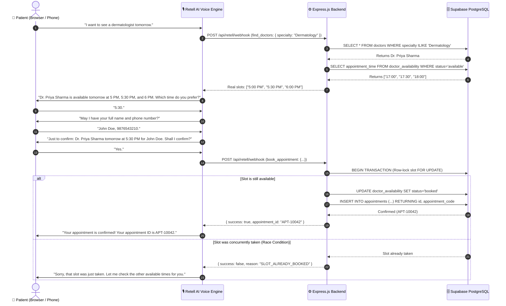

# 🏥 MedVoice AI — AI-Powered Doctor Appointment Assistant

**MedVoice AI** is a full-stack, production-ready AI Voice Agent application for automated doctor appointment discovery and booking. Powered by **Retell AI**, **Node.js/Express.js**, **Supabase PostgreSQL**, and **React + Vite + Tailwind CSS**, it enables patients to converse naturally over voice to discover doctors, query **real-time verified clinic availability**, select slots, and complete confirmed bookings without hallucinations.

---

## 🌟 Key Capabilities & Architectural Highlights

1. **Zero-Hallucination Availability**: The voice agent strictly queries the database for available slots. The LLM is structurally constrained from inventing doctors, slots, or confirmation codes.
2. **Atomic Race-Condition Protection**: Employs row-level locking (`FOR UPDATE` / atomic compare-and-set transactions) to ensure that if two callers attempt to book the exact same slot at the exact same millisecond, only one succeeds and the other receives `SLOT_ALREADY_BOOKED` (HTTP 409).
3. **IST (`Asia/Kolkata`) Natural Date & Time Engine**: Intelligently normalizes colloquial phrases like *"tomorrow"*, *"this Friday"*, *"around 5 PM"*, and *"evening"* into strict `YYYY-MM-DD` and `HH:mm` format.
4. **Dual Voice Support**:
   - **Retell AI WebRTC**: Low-latency browser calling via `retell-client-js-sdk` and Retell custom tool webhooks.
   - **Browser Speech AI Mode**: Zero-config local browser speech recognition and synthesis mode with real-time backend tool execution logs for instant testing before setting up Retell credentials.
5. **Real-time Live Updates**: Automatic dashboard synchronization reflecting appointments, status changes, and newly opened/closed slots.

---

## 🏗️ Architecture Diagram



---

## 🛠️ Technology Stack

| Layer | Technology | Purpose |
| :--- | :--- | :--- |
| **Frontend** | React 18, Vite, Tailwind CSS, Lucide Icons | Responsive medical dashboard, WebRTC voice card, visualizer, slot booking & reschedule modals |
| **Backend** | Node.js (v20+), Express.js, CORS, Helmet, Morgan | REST APIs, Retell custom tool webhook router, date normalization service |
| **Database** | Supabase (PostgreSQL 15+) / Relational Store | Doctors, patients, availability slots, appointments, foreign keys, composite indexes, atomic RPC |
| **Voice AI** | Retell AI (`retell-sdk`, `retell-client-js-sdk`) | Speech-to-speech voice agent, low-latency conversational LLM with function calling |
| **Testing** | Jest, Supertest | Automated test suite verifying APIs, double-booking prevention, cancellations, tool calling |

---

## 🗄️ Database Schema

### 1. `doctors`
- `id` (SERIAL PRIMARY KEY)
- `name` (VARCHAR)
- `specialty` (VARCHAR)
- `qualification` (VARCHAR)
- `experience` (INT)
- `consultation_fee` (NUMERIC)
- `location` (VARCHAR)
- `available` (BOOLEAN)
- `created_at` (TIMESTAMPTZ)

### 2. `doctor_availability`
- `id` (SERIAL PRIMARY KEY)
- `doctor_id` (INT REFERENCES doctors(id) ON DELETE CASCADE)
- `appointment_date` (DATE)
- `appointment_time` (VARCHAR, e.g. `'17:30'`)
- `status` (`'available'` | `'booked'` | `'blocked'`)
- `created_at` (TIMESTAMPTZ)
- *Constraint*: `UNIQUE(doctor_id, appointment_date, appointment_time)`

### 3. `patients`
- `id` (SERIAL PRIMARY KEY)
- `name` (VARCHAR)
- `phone` (VARCHAR)
- `email` (VARCHAR)
- `created_at` (TIMESTAMPTZ)

### 4. `appointments`
- `id` (SERIAL PRIMARY KEY)
- `appointment_code` (VARCHAR UNIQUE, e.g. `'APT-10042'`)
- `patient_id` (INT REFERENCES patients(id))
- `doctor_id` (INT REFERENCES doctors(id))
- `appointment_date` (DATE)
- `appointment_time` (VARCHAR)
- `status` (`'confirmed'` | `'cancelled'` | `'completed'`)
- `reason` (TEXT)
- `created_at` (TIMESTAMPTZ)

---

## 🔌 REST API Endpoints

### Doctors & Availability
- `GET /api/doctors` — List all active doctors (optional filter: `?specialty=dermatology`).
- `GET /api/doctors/:id` — Get detailed doctor profile.
- `GET /api/doctors/:id/availability?date=2026-10-08` — Returns verified available slots (supports `"tomorrow"`, `"Friday"`).

### Appointments
- `GET /api/appointments` — List all scheduled appointments with doctor and patient metadata.
- `POST /api/appointments` — Atomically book an appointment.
  ```json
  {
    "doctor_id": 1,
    "patient_name": "John Doe",
    "patient_phone": "9876543210",
    "patient_email": "john@example.com",
    "appointment_date": "2026-10-08",
    "appointment_time": "17:30",
    "reason": "Skin consultation"
  }
  ```
- `DELETE /api/appointments/:id` — Cancel appointment and atomically release slot back to `available`.
- `PATCH /api/appointments/:id` — Reschedule appointment to a new verified slot.

### Voice & Retell AI Tools
- `POST /api/voice/create-web-call` — Generates a Retell Web Call session token for browser calling.
- `POST /api/voice/simulate-agent` — Interactive conversation pipeline with live tool execution.
- `POST /api/retell/webhook` — Universal webhook router for Retell AI tool calling (`find_doctors`, `get_available_slots`, `book_appointment`, `cancel_appointment`, `reschedule_appointment`).
- `POST /api/retell/tools/:toolName` — Direct endpoints for individual tool hooks.
- `POST /api/reset` — Resets slots and test appointments on demand.
- `GET /api/health` — Checks status of database, timezone, and Retell integration.

---

## ⚙️ Environment Variables

Create `backend/.env` with the following keys:

```env
# Server
PORT=5000
NODE_ENV=development

# Supabase PostgreSQL
SUPABASE_URL=https://your-project.supabase.co
SUPABASE_ANON_KEY=your-supabase-anon-key
SUPABASE_SERVICE_ROLE_KEY=your-supabase-service-role-key

# Retell AI
RETELL_API_KEY=key_your_retell_api_key
RETELL_AGENT_ID=agent_your_retell_agent_id

# Public URL for Webhooks (Required in Production / Ngrok)
BACKEND_PUBLIC_URL=https://your-backend.onrender.com
```

> **Note**: If `SUPABASE_URL` is omitted during local evaluation, the backend automatically initializes an in-memory transactional database seeded with dynamic dates so all features and tests function out of the box!

---

## 🚀 Quickstart & Local Setup

### 1. Clone & Install Dependencies

```bash
# In the medvoice-ai directory:
cd backend
npm install

cd ../frontend
npm install
```

### 2. Run Automated Test Suite

```bash
cd backend
npm test
```
*Executes all 19 unit, concurrency, race condition, and voice-flow simulation tests.*

### 3. Start Backend Server

```bash
cd backend
npm run dev
# Server will run on http://localhost:5000
```

### 4. Start Frontend Dashboard

```bash
cd frontend
npm run dev
# Dashboard opens on http://localhost:3000
```

---

## 🎙️ Retell AI Integration Guide

### Automated Provisioning Script
Once you have your `RETELL_API_KEY`, run:

```bash
npm run setup:retell
```
This automated script (`voice-agent/setupRetellAgent.js`):
1. Creates the LLM engine configured with the **MedVoice System Prompt** (`voice-agent/agentPrompt.js`).
2. Registers all 5 custom function tools (`find_doctors`, `get_available_slots`, `book_appointment`, `cancel_appointment`, `reschedule_appointment`) with schemas.
3. Provisions the voice agent with a professional tone (`11labs-Adrian` or medical voice).
4. Outputs your `RETELL_AGENT_ID` to paste into `backend/.env`.

---

## 🚢 Production Deployment

### Backend (Render / Railway)
1. Deploy `medvoice-ai/backend` as a Node.js web service.
2. Set Build Command: `npm install`.
3. Set Start Command: `node server.js`.
4. Add environment variables (`SUPABASE_URL`, `SUPABASE_SERVICE_ROLE_KEY`, `RETELL_API_KEY`, `RETELL_AGENT_ID`, `BACKEND_PUBLIC_URL`).

### Frontend (Vercel)
1. Deploy `medvoice-ai/frontend` to Vercel.
2. Build Command: `npm run build`.
3. Output Directory: `dist`.
4. Configure rewrite in `vercel.json` to route `/api/*` to your production backend URL.

### Database (Supabase)
1. In your Supabase Project dashboard, go to the **SQL Editor**.
2. Run `database/schema.sql` to create tables, indexes, and stored procedures.
3. Run `node database/seedSupabase.js` to populate doctors and dynamic slots.

---

## 📄 License
MIT © 2026 MedVoice AI.
